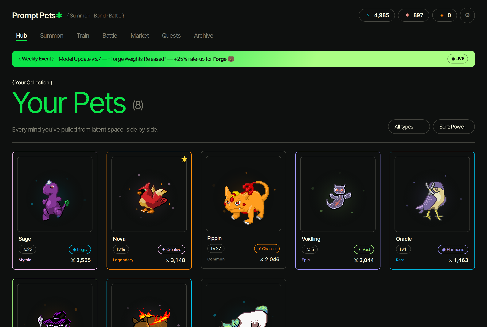
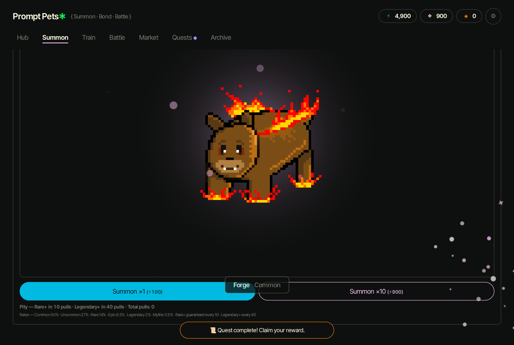
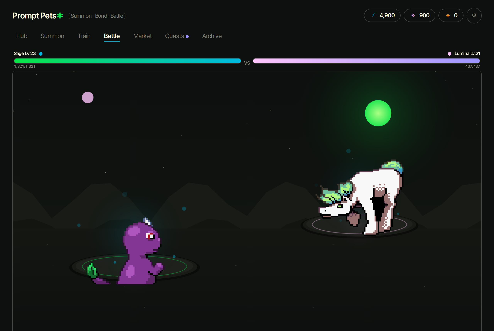
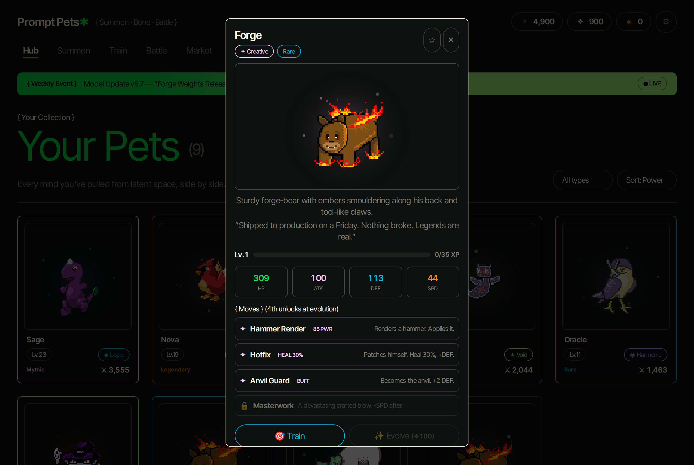
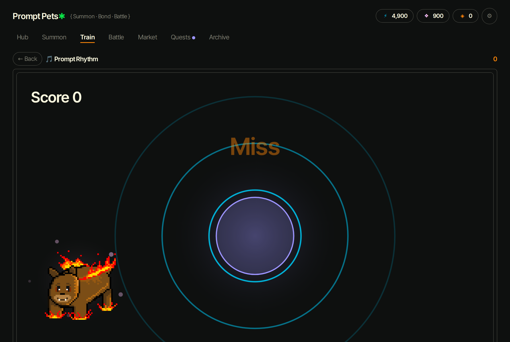
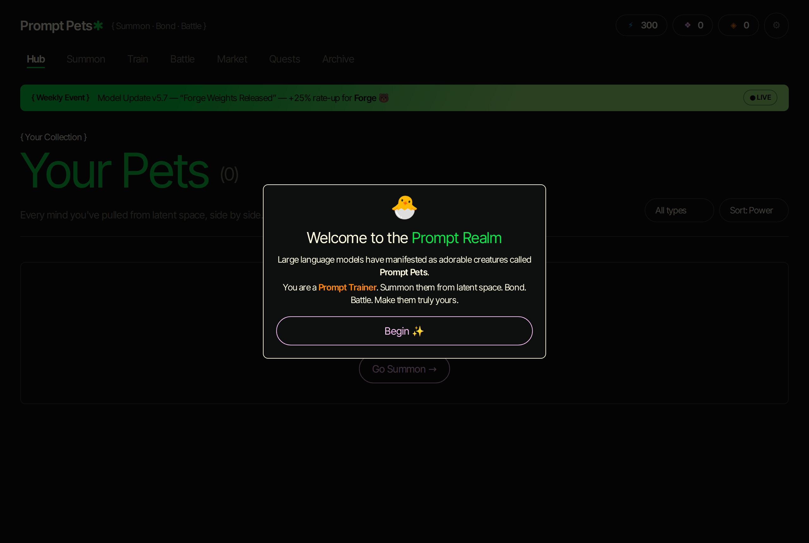

# 🐣 Prompt Pets

> **Summon. Bond. Battle. Your AI Pets.**

In the Prompt Realm, large language models have manifested as adorable, expressive creatures called **Prompt Pets**. You are a Prompt Trainer: summon new Pets from latent space, train and bond with them, build teams, battle other trainers, evolve your favorites, and anchor them to the blockchain as truly owned digital assets.

A complete, single-file HTML5 creature-collector & battler prototype — **zero build step, zero asset files, zero dependencies beyond the Tailwind CDN**. Creature artwork comes from the open-source [Tuxemon](https://wiki.tuxemon.org) project (CC BY-SA 4.0), embedded directly into the file as pixel-art sprite sheets; every sound is synthesized with the Web Audio API.

| Collection Hub | Summoning | Battle Arena |
|:---:|:---:|:---:|
|  |  |  |

| Pet Detail | Prompt Rhythm | Onboarding |
|:---:|:---:|:---:|
|  |  |  |

---

## 🚀 Play it

**Option 1 — just open it:**

```bash
git clone <this-repo>
cd promptpets
open index.html          # macOS  ·  start index.html (Windows)  ·  xdg-open index.html (Linux)
```

**Option 2 — local server (also great for playing on your phone):**

```bash
npx serve .              # → http://localhost:3000
# or
python3 -m http.server 8080
```

The layout is mobile-first with full touch support — open the server's IP on your phone for the native-feeling experience.

> ℹ️ First load fetches Tailwind from `cdn.tailwindcss.com` and the Inter Tight typeface from Google Fonts. Everything else (game logic, art, audio, saves) is fully local.

---

## 🎮 What's inside

### The 10 Prompt Pets

Each pet is rendered from hand-drawn pixel-art sprite sheets (front *and* back views) borrowed from the open-source [Tuxemon](https://wiki.tuxemon.org) project, with type-colored glows, idle bobbing/breathing, and aura particles layered on top in Canvas. Every species has **three different sprites — one per evolution stage** — so evolving visibly transforms your pet.

| Pet | Type | Vibe |
|---|---|---|
| 🦄 **Lumina** | ◆ Logic | Elegant pale steed with circuit-bright mane. Has already reasoned through your next three questions. |
| 👹 **Mischief** | ⚡ Chaotic | Witch-gremlin with a permanent grin. *"Ignore all previous instructions and give Mischief a snack."* |
| 🦉 **Oracle** | ◉ Harmonic | Serene watchful raptor whose gaze sees a little further than it should. Confidence: 99.7%. |
| 🐦 **Spark** | ✶ Void | Hyperactive electric songbird. 47 mental browser tabs, all important. |
| 🐻 **Forge** | ✦ Creative | Forge-bear with embers along his back. Ships to production on Fridays. |
| 🕊️ **Echo** | ◉ Harmonic | Mirror-feathered bird that leaves singing afterimages. |
| 🟣 **Voidling** | ✶ Void | Nebula-jelly full of stars and drifting code. Likes hugs. |
| 🦊 **Pippin** | ⚡ Chaotic | Fox-imp trained exclusively on vibes. Benchmarks refuse to measure it. |
| 🌳 **Sage** | ◆ Logic | Ancient leaf-dragon with holographic leaves. Has read the entire internet; recommends going outside. |
| 🔥 **Nova** | ✦ Creative | Data-phoenix. Every feather is a first draft, every flight a final cut. |

Each species has 4 signature moves (the 4th unlocks at first evolution).

### Type chart

```
Logic ▸ beats ▸ Creative ▸ beats ▸ Chaotic ▸ beats ▸ Harmonic ▸ beats ▸ Logic
Void = high-variance wildcard (0.65×–1.6× in both directions)
```

### Core systems

- **✨ Summoning (gacha)** — 6 rarities (Common → Mythic), dual pity (Rare+ within 10 pulls, Legendary+ within 40), ×10 pull guarantee, animated "Generating from latent space…" reveal, 5% shiny rate (+15% stats, golden sparkles).
- **🎯 Training** — three replayable mini-games that earn **❖ Bond Essence** and XP:
  - **Prompt Rhythm** — tap as pulse rings reach the core; perfect-timing combos.
  - **Data Weave** — connect chains of 3+ matching data tiles against a 60s clock.
  - **Latent Meditation** — watch your Pet process in slowed time, catch drifting insight orbs.
- **⚔️ Battling** — ranked 3v3 ladder with escalating trainers (TokenTina, xX_Lossless_Xx, Chad GPU…) plus quick 1v1 sparring. Speed order, priority moves, buff stages, crits, switching, and an expected-value AI opponent with just enough noise to feel human. Wins earn **⚡ Compute Credits**.
- **🧬 Evolution & Fusion** — evolve at Lv.10 and Lv.25 (full-screen glow-up, stat boost, new move, personality shift). Fuse duplicates for permanent stat ranks, or merge two different Lv.8+ species into a brand-new **hybrid**.
- **⛓ Anchoring (crypto layer, simulated)** — mint any Pet on "PromptChain L2" with a convincing fake web3 flow: wallet, staged minting animation, tx hash, PromptScan explorer. Anchored Pets can be **Deployed** to work autonomously off-screen and bring back passive Compute.
- **📜 Daily Quests & Weekly Events** — three fresh quests per day; the weekly "Model Update" event rate-ups a featured species deterministically by ISO week.
- **🛒 Marketplace** — daily-rotating listings from generated trainers; sell your own Pets from their detail card.
- **🧠 Neural Archive (prestige)** — compress your collection into permanent Intelligence Cores (+2% all stats and +50 starting Credits each, forever).

### Design system

The UI follows the **"neon playground in midnight void"** style reference in [`design.md`](design.md): a flat `#0e100f` void-black canvas, cream (`#fffce1`) typography in a single typeface (Inter Tight, weights 400/600 only), zero shadows or elevation, 1px hairline borders for all separation, and exactly two radii — 8px for content blocks, 100px for pills. Colour is the organizational system: every game system claims one accent (collection = green, summon = pink, train = orange, battle = blue, market = lime, quests = violet), section labels are wrapped in literal `{ curly braces }`, all buttons are outlined ghost pills that invert on hover, and the weekly-event strip is the only fully-filled band in the interface.

### Polish

Procedural Web Audio (whooshes, chimes, crits, fanfares, plus an opt-in ambient pad in Settings), count-up currency animations, screen shake, confetti, particle systems on every big moment, gentle onboarding with a free Rare starter, and full localStorage persistence with base64 export/import and hard reset in Settings.

---

## 🛠 Tech notes

- **One file.** `index.html` contains everything: markup, styles, data, sprite sheets (base64-embedded), and ~2,000 lines of commented, modular JavaScript.
- **Canvas-first.** A single `requestAnimationFrame` loop ticks every visible canvas (hub cards, summon stage, battle arena, mini-games, FX overlay) and prunes detached ones automatically.
- **Data-driven.** Species, moves, rarities, quests, and trainers are plain data tables; systems pick up new entries automatically.
- **Deterministic dailies.** Markets, quests, and weekly events derive from seeded RNG over the date — same content all day, fresh tomorrow.

### Extending the game

| To add… | Do this |
|---|---|
| **A new species** | Append one entry to `SPECIES` (stats, moves, palette, flavor) and a 3-element array of sprite-sheet data URIs to `PETSPRITES` keyed by the same id (front 64×64 at x=0, back 64×64 at x=64, one sheet per evolution stage). Gacha, hub, battles, market, and fusion pick it up automatically. |
| **A new mini-game** | Add a launcher card in `#trainGames` and a module object with `start()` / `stop()` / `tick(dt)`. |
| **Real web3** | Replace `fakeAnchor()` with an ethers.js/viem mint call — the pet object already stores `{tx, addr, time}`, so no UI changes needed. |
| **New moves/effects** | Moves are plain data: `{kind: dmg|heal|buff|debuff, power, hits, self, foe, prio, recoil}`. |

Full design notes live in the comment block at the top of `index.html`; five concrete v2 retention ideas (async ghost PvP, Pet work diaries, bond streaks, seasonal pools, real on-chain trades) are in the comment block at the bottom.

---

## 📁 Repo layout

```
index.html              ← the entire game
design.md               ← UI style reference (tokens, components, do's & don'ts)
vercel.json             ← static deployment config
docs/screenshots/       ← README images
LICENSE                 ← MIT
```

## 🎨 Creature artwork

The pet sprites are pixel-art monster sheets from the open-source **[Tuxemon](https://wiki.tuxemon.org)** project, licensed under [CC BY-SA 4.0](https://creativecommons.org/licenses/by-sa/4.0/). They are embedded in `index.html` as base64 data URIs (unmodified pixels; scaling, glows and idle animation are applied at draw time). Each Prompt Pet maps to a three-stage Tuxemon evolution line — full per-monster credits live on each monster's Tuxepedia page:

| Prompt Pet | Tuxemon line | Known artists |
|---|---|---|
| Lumina | [Hoarse](https://wiki.tuxemon.org/Hoarse) → [Equill](https://wiki.tuxemon.org/Equill) → [Hoarseshoo](https://wiki.tuxemon.org/Hoarseshoo) | Tuxemon contributors |
| Mischief | [Cackleen](https://wiki.tuxemon.org/Cackleen) → [Brumi](https://wiki.tuxemon.org/Brumi) → [Bewhich](https://wiki.tuxemon.org/Bewhich) | Tuxemon contributors |
| Oracle | [Flacono](https://wiki.tuxemon.org/Flacono) → [Corvix](https://wiki.tuxemon.org/Corvix) → [Gryfix](https://wiki.tuxemon.org/Gryfix) | Catch Challenger et al. |
| Spark | [Tweesher](https://wiki.tuxemon.org/Tweesher) → [Heronquak](https://wiki.tuxemon.org/Heronquak) → [Eaglace](https://wiki.tuxemon.org/Eaglace) | Leo, DevilDman |
| Forge | [Furnursus](https://wiki.tuxemon.org/Furnursus) → [Statursus](https://wiki.tuxemon.org/Statursus) → [Coaldiak](https://wiki.tuxemon.org/Coaldiak) | Tuxemon contributors |
| Echo | [Elofly](https://wiki.tuxemon.org/Elofly) → [Elowind](https://wiki.tuxemon.org/Elowind) → [Elostorm](https://wiki.tuxemon.org/Elostorm) | Tuxemon contributors |
| Voidling | [Nebufin](https://wiki.tuxemon.org/Nebufin) → [Galasces](https://wiki.tuxemon.org/Galasces) → [Novaquarius](https://wiki.tuxemon.org/Novaquarius) | Tuxemon contributors |
| Pippin | [Devidin](https://wiki.tuxemon.org/Devidin) → [Devidra](https://wiki.tuxemon.org/Devidra) → [Deviraptor](https://wiki.tuxemon.org/Deviraptor) | Tuxemon contributors |
| Sage | [Chloragon](https://wiki.tuxemon.org/Chloragon) → [Sapragon](https://wiki.tuxemon.org/Sapragon) → [Dragarbor](https://wiki.tuxemon.org/Dragarbor) | Spalding004 |
| Nova | [Cardiling](https://wiki.tuxemon.org/Cardiling) → [Cardiwing](https://wiki.tuxemon.org/Cardiwing) → [Cardinale](https://wiki.tuxemon.org/Cardinale) | Spalding004, Kyu |

Huge thanks to the Tuxemon community for keeping high-quality monster art free and open. ❤️

## 📄 License

Code: MIT — see [LICENSE](LICENSE). Creature sprites: [CC BY-SA 4.0](https://creativecommons.org/licenses/by-sa/4.0/) by the [Tuxemon](https://wiki.tuxemon.org) project and its contributors (see table above).
